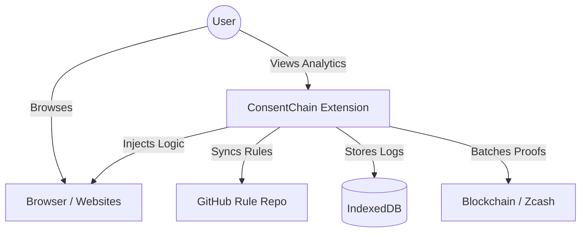
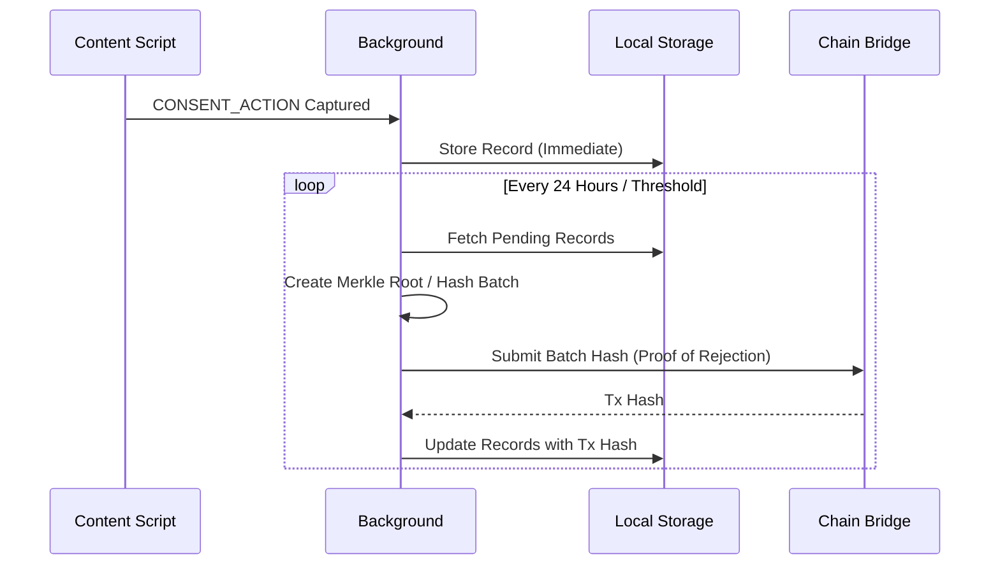

# ConsentChain Architecture Overview

## 1. High-Level System Design

ConsentChain is built on a **Hybrid Architecture** that combines local browser automation with decentralized verification.

### Core Stack
*   **Extension**: JavaScript (ES6+), Manifest V3
    *   **Frontend**: HTML5, CSS Grid, Chart.js
    *   **Storage**: IndexedDB (Local Logs), chrome.storage (Preferences)
*   **Blockchain**:
    *   **Contract**: Solidity (EVM)
    *   **Bridge**: ethers.js + Zcash Client (Mock)
*   **Backend**:
    *   **Rule Sync**: GitHub Raw (CDN)
    *   **Dashboard**: Node.js (Localhost Server)

### System Context Diagram



---

## 2. Key Workflows

### A. The Hybrid Detection Engine
Combines deterministic rules with semantic heuristics.

```mermaid
graph TD
    A[Page Load] --> B{Check URL against Rules};
    B -- Match --> C[Consent-O-Matic Adapter];
    B -- No Match --> D[Legacy Heuristic Detector];
    
    C --> C1[Extract Policy Data];
    C --> C2[Execute Action (Click/Hide)];
    
    D --> D1[Scan DOM for Keywords];
    D --> D2[Attempt Generic Interaction];
    
    C1 --> E[Proverb Engine];
    D1 --> E;
    
    E --> F[Generate Hash];
    
    F --> G[Blockchain Queue];
```

### B. Dual-Chain Protocol (Verification)



---

## 3. Component Hierarchy

### Extension Components
1.  **`content.js` (The Eye)**:
    *   **`EnhancedConsentChainDetector`**: Orchestrator.
    *   **`ConsentOMaticAdapter`**: Runs 200+ specific rules.
    *   **`Matcher`**: CSS/XPath evaluation.
2.  **`background.js` (The Brain)**:
    *   **`DualChainManager`**: Manages batching and chain writes.
    *   **`RuleSyncService`**: Keeps rules updated.
    *   **`CookieClassifier`**: The "Cookie Monster" engine.
3.  **Dashboard (The Face)**:
    *   **`app.js`**: Single Page Application (SPA) logic.
    *   **Dual-Dashboard**: Supports both Extension-popup view and Localhost full-view.

---

## 4. Dual-Dashboard Architecture
*(Legacy View)*

### **1. Extension Dashboard** (chrome-extension://...)
**Purpose**: Local data viewing and export (works offline).
*   ✅ View all consent data
*   ✅ Analytics & statistics
*   ❌ NO wallet/blockchain features

### **2. Blockchain Dashboard** (http://localhost:8080)
**Purpose**: Full blockchain integration with wallet support.
*   ✅ Submits batches to blockchain
*   ✅ Connects MetaMask
