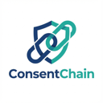

# ConsentChain V2.0 - Blockchain-Backed Consent Automation

> **Replace cookie banners with cryptographically verifiable, user-sovereign consent contracts.**



## Overview

**ConsentChain** (formerly MyTerms) is a browser extension that automates your interactions with cookie consent banners (CMPs) and anchors your decisions to the blockchain.

**New in V2.0:** We have integrated the powerful **Consent-O-Matic** rule engine, instantly expanding support to widely used CMPs like OneTrust, Cookiebot, Quantcast, and 200+ others.

### Why ConsentChain?
1.  **Zero Banner Fatigue**: Automatically handles popups based on your preferences.
2.  **Verifiable Truth**: Every consent decision is hashed and batched to a smart contract (`MyTermsConsentLedger`).
3.  **Privacy Proverb**: A cryptographic proof of your intent, allowing for "don't ask me again" portability.
4.  **Cookie Monster**: Analyzes and eats tracking cookies that violate your terms.

---

## Key Features

| Feature | Description |
| :--- | :--- |
| **Hybrid Detection Engine** | Combines **Consent-O-Matic** rules (200+ sites) with custom semantic heuristics for maximum coverage. |
| **Privacy Proverbs** | Generates a hash (`SHA-256`) of your specific policy preferences (e.g., "Analytics: NO", "Functional: YES"). |
| **Dual-Chain Storage** | **Public**: Ethereum/Sepolia for immutable policy anchoring.<br>**Private**: Zcash shielded transactions for user anonymity. |
| **Cookie Monster** | Scans your browser for tracking cookies and deletes them if they mismatch your defined policy. |
| **Dashboard** | A clean, local interface to view your consent timeline, manage keys, and verify blockchain proofs. |

---

## 🚀 Getting Started

We have simplified the setup process. Please refer to our **[QUICKSTART.md](QUICKSTART.md)** for a step-by-step guide.

### Quick Command Line Setup
```bash
# 1. Clone the repo
git clone https://github.com/roguedev-ai/myterms-extension.git
cd myterms-extension

# 2. Setup dependencies (includes rule sync)
./setup.sh

# 3. Start local development environment
./dev-start.sh
```

---

## Documentation

*   **[QUICKSTART.md](QUICKSTART.md)**: Installation, Wallet Setup, and First Run.
*   **[TROUBLESHOOTING.md](TROUBLESHOOTING.md)**: Common issues (Localhost bridge, CMP detection failures).
*   **[TECHNICAL_SPEC.md](TECHNICAL_SPEC.md)**: Deep dive into the Hybrid Architecture, Adapters, and Proverb Engine.
*   **[EXECUTIVE_BRIEF.md](EXECUTIVE_BRIEF.md)**: High-level summary for stakeholders.

---

## Architecture: The V2 Hybrid Engine

ConsentChain V2 uses a layered approach to handling banners:

1.  **Rule-Based Detection (Fast)**: Checks the site against a local cache of ~200 known CMP rules (synced from Consent-O-Matic). If a match is found (e.g., OneTrust), it uses the specific rule to extract policy data and execute the decision.
2.  **Heuristic Fallback (Smart)**: If no rule matches, the legacy `EnhancedBannerDetector` scans the DOM for common patterns (buttons labeled "Technically Necessary", "Reject All", etc.) and attempts to negotiate.

### System Components
*   **Extension**: Manifest V3, Content Scripts, Background Worker.
*   **Smart Contract**: `MyTermsConsentLedger.sol` (Batch logging).
*   **Dashboard**: Local web app for analytics and control.

---

## Contributing

We welcome contributions! Specifically:
*   **New CMP Rules**: Add support for more banner types via the `extension/lib/rules` directory.
*   **Core Logic**: Improvements to the Proverb Engine or Chain Adapters.

See **[CONTRIBUTING.md](CONTRIBUTING.md)** for details.

---

## License
MIT
