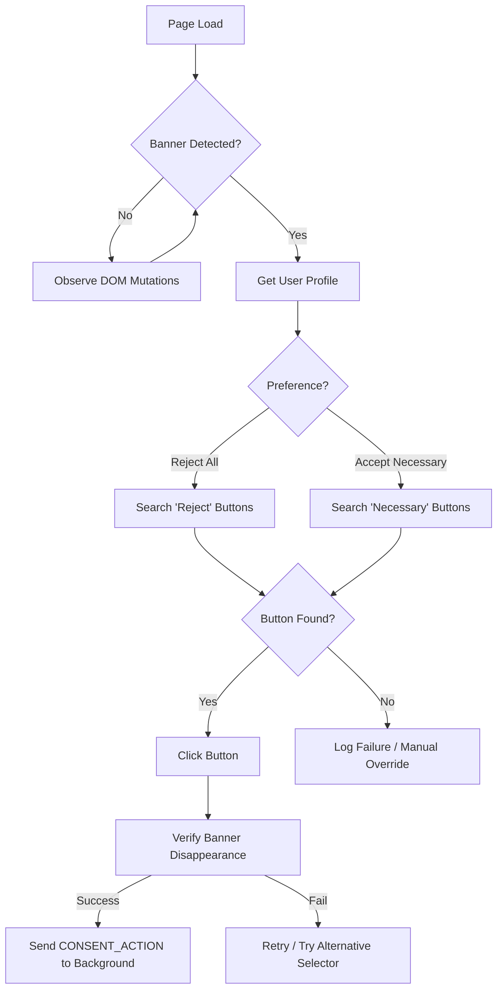
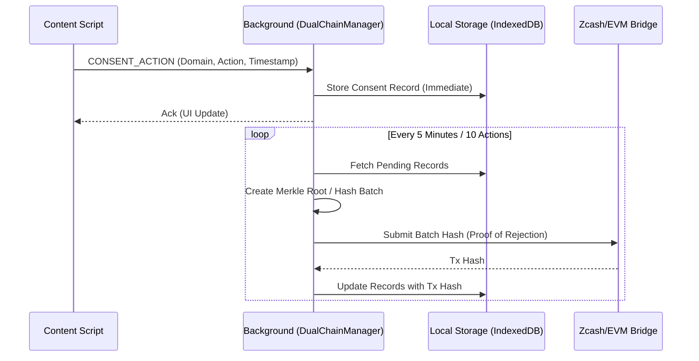
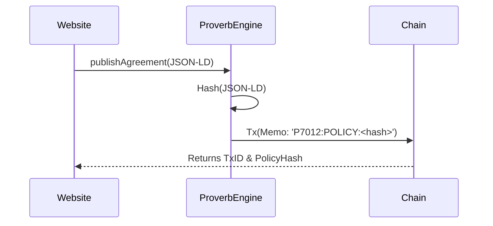
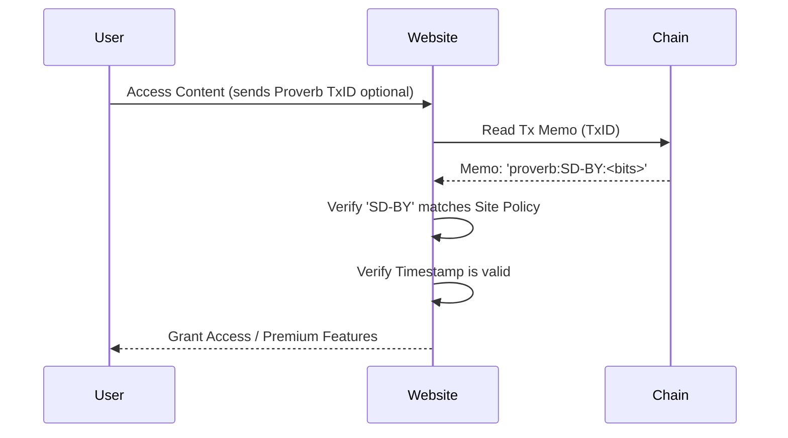

# ConsentChain Technical Specification (V2.0)

## 1. System Architecture (Hybrid V2)

ConsentChain V2 employs a **Hybrid Detection Engine** that prioritizes deterministic rules over heuristic guessing.

```mermaid
graph TD
    A[Page Load] --> B{Check URL against Rules};
    B -- Match --> C[Consent-O-Matic Adapter];
    B -- No Match --> D[Legacy Heuristic Detector];
    
    C --> C1[Extract Policy Data];
    C --> C2[Execute Action (Click/Hide)];
    
    D --> D1[Scan DOM for Keywords];
    D --> D2[Attempt Generic Interaction];
    
    C1 --> E[Proverb Engine];
    D1 --> E;
    
    E --> F[Generate Hash];
    F --> G[Blockchain Queue];
```

### Components

#### A. Consent-O-Matic Adapter (`extension/lib/adapters`)
*   **Role**: Bridges the extension to the 200+ rule library.
*   **Input**: DOM Document.
*   **Output**: Standardized "Decision" object + Structured Policy Data (Vendors, Purposes).

#### B. Rule Sync Service (`extension/lib/rule-sync`)
*   **Role**: Keeps the local rule database fresh.
*   **Mechanism**: Fetches JSON from upstream GitHub repo once/24h.
*   **Storage**: Cached in `chrome.storage.local`.

#### C. Policy Extractor (`extension/lib/policy-extractor`)
*   **Role**: Parses the CMP's UI to understand *what* is being consented to.
*   **Capabilities**:
    *   Extract Vendor Lists (IAB TCF).
    *   Map Purpose Categories (Analytics vs Functional).

---

## 2. Dual-Chain Protocol
*(Unchanged from V1 - See below)*
kground service worker (Chain management).

#### Workflows

**A. Heuristic Banner Detection & Action**
The `EnhancedBannerDetector` in `content.js` is responsible for identifying and interacting with consent banners.



**B. Dual-Chain Storage (Background)**
Once an action is taken, it is stored locally for speed and batched for the blockchain for verification.



### Key Classes
*   **`EnhancedBannerDetector` (`content.js`)**:
    *   `heuristics`: Array of scoring functions to identify banner elements.
    *   `clickButton(banner, selectors)`: Robust click simulation (mousedown/up/click).
*   **`DualChainManager` (`dual-chain.js`)**:
    *   `addParams(consentData)`: Queues a new action.
    *   `finalizeBatch()`: Hushes data and submits to the configured chain provider.

### Proverb Engine Workflow
The `ProverbEngine` handles the cryptographic lifecycle of an agreement, from the user's intent to the website's verification.

#### 1. User: Generating a Proverb
When a user visits a site and auto-consents (via `DualChainManager`), a "Privacy Proverb" is generated.

```mermaid
graph TD
    A[User Preferences] --> B[MyTermsParser];
    B -->|Map to Standard| C[Agreement Type e.g., SD-BY];
    C --> D[ProverbEngine];
    D -->|Hash(Type + Bits + Timestamp)| E[Proverb Hash];
    
    E --> F[Zcash Wallet];
    F -->|Memo: 'proverb:SD-BY:<bits>'| G[Shielded Tx];
    G --> H[Blockchain Record];
```

#### 2. Website: Publishing & Verification
Websites can publish their terms to the chain to create a referenceable hash, and verify user proverbs.

**A. Publishing Terms**


**B. Verifying User Consent**


---

## 2. Cookie Monster (Analysis & Cleanup)

### Architecture
Cookie Monster operates entirely within the extension context, leveraging the `chrome.cookies` API and a regex-based classification engine.

#### Workflow

**Analysis & Deletion Flow**

```mermaid
graph TD
    A[Dashboard UI] -->|User Clicks 'Scan'| B[ANALYZE_COOKIES Message]
    B --> C[Background: chrome.cookies.getAll()]
    C --> D[CookieClassifier]
    
    subgraph Classification Engine
    D --> E{Match Regex?}
    E -- 'sess|id|auth' --> F[Category: SECURITY 🟢]
    E -- 'pref|lang|ui' --> G[Category: FUNCTIONAL 🔵]
    E -- 'ga|pixel|track' --> H[Category: ANALYTICS 🟠]
    E -- 'ads|doubleclick' --> I[Category: MARKETING 🔴]
    E -- No Match --> J[Category: UNKNOWN ⚪]
    end
    
    F & G & H & I & J --> K[Calculate Privacy Score]
    K --> L[Return Report to UI]
    L --> M[Display Score & Charts]
    
    A -->|User Clicks 'Eat Cookies'| N[COOKIE_MONSTER Message]
    N --> O[Filter Cookies (Analytics + Marketing)]
    O --> P[chrome.cookies.remove()]
    P --> Q[Return 'Eaten' Count]
    Q --> R[Refesh UI]
```

### Key Classes
*   **`CookieClassifier` (`utils/cookie-classifier.js`)**:
    *   `analyze(cookies)`: Main entry point. Returns `{ privacyScore, stats, cookies }`.
    *   `getCategory(cookie)`: Matches cookie name/domain against `PATTERNS`.
    *   `calculateScore(stats)`: Algorithm: `100 - (Tracking * 2) - (Analytics * 1)`.
*   **`AnalysisController` (`dashboard/app.js`)**:
    *   manages the UI state, Chart.js rendering, and user confirmation for deletion.

### Security Considerations
*   **Safe Deletion**: The system defaults to ONLY deleting Analytics and Marketing cookies. Security and Functional cookies are whitelisted to prevent logging users out of active sessions.
*   **Permission Scope**: Requires the `cookies` permission in `manifest.json`.
