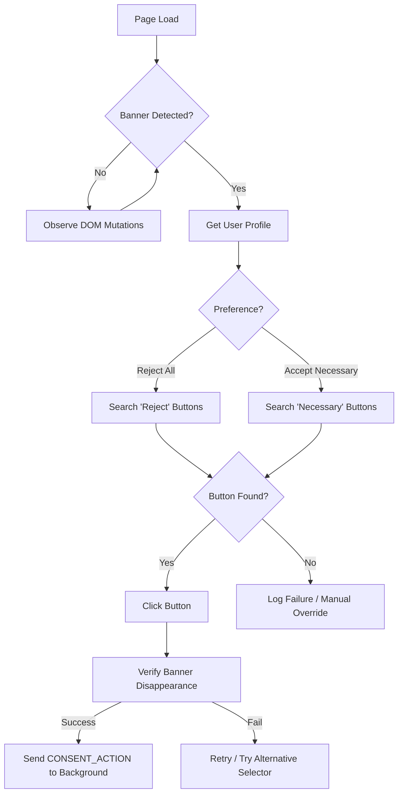
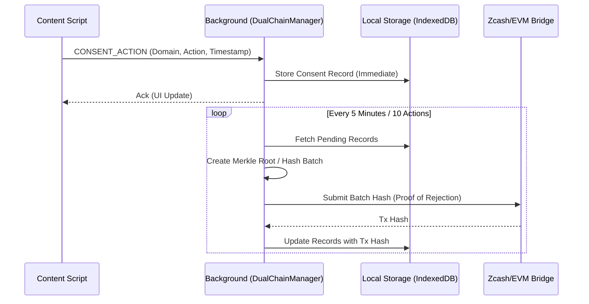

# Technical Specification & Logic Maps

This document details the technical implementation and workflows for the "Dual-Chain Protocol" and "Cookie Monster" features.

## 1. Dual-Chain Protocol (Consent Automation)

### Architecture
The auto-consent system relies on a feedback loop between the content script (DOM interaction) and the background service worker (Chain management).

#### Workflows

**A. Heuristic Banner Detection & Action**
The `EnhancedBannerDetector` in `content.js` is responsible for identifying and interacting with consent banners.



**B. Dual-Chain Storage (Background)**
Once an action is taken, it is stored locally for speed and batched for the blockchain for verification.



### Key Classes
*   **`EnhancedBannerDetector` (`content.js`)**:
    *   `heuristics`: Array of scoring functions to identify banner elements.
    *   `clickButton(banner, selectors)`: Robust click simulation (mousedown/up/click).
*   **`DualChainManager` (`dual-chain.js`)**:
    *   `addParams(consentData)`: Queues a new action.
    *   `finalizeBatch()`: Hushes data and submits to the configured chain provider.

---

## 2. Cookie Monster (Analysis & Cleanup)

### Architecture
Cookie Monster operates entirely within the extension context, leveraging the `chrome.cookies` API and a regex-based classification engine.

#### Workflow

**Analysis & Deletion Flow**

```mermaid
graph TD
    A[Dashboard UI] -->|User Clicks 'Scan'| B[ANALYZE_COOKIES Message]
    B --> C[Background: chrome.cookies.getAll()]
    C --> D[CookieClassifier]
    
    subgraph Classification Engine
    D --> E{Match Regex?}
    E -- 'sess|id|auth' --> F[Category: SECURITY 🟢]
    E -- 'pref|lang|ui' --> G[Category: FUNCTIONAL 🔵]
    E -- 'ga|pixel|track' --> H[Category: ANALYTICS 🟠]
    E -- 'ads|doubleclick' --> I[Category: MARKETING 🔴]
    E -- No Match --> J[Category: UNKNOWN ⚪]
    end
    
    F & G & H & I & J --> K[Calculate Privacy Score]
    K --> L[Return Report to UI]
    L --> M[Display Score & Charts]
    
    A -->|User Clicks 'Eat Cookies'| N[COOKIE_MONSTER Message]
    N --> O[Filter Cookies (Analytics + Marketing)]
    O --> P[chrome.cookies.remove()]
    P --> Q[Return 'Eaten' Count]
    Q --> R[Refesh UI]
```

### Key Classes
*   **`CookieClassifier` (`utils/cookie-classifier.js`)**:
    *   `analyze(cookies)`: Main entry point. Returns `{ privacyScore, stats, cookies }`.
    *   `getCategory(cookie)`: Matches cookie name/domain against `PATTERNS`.
    *   `calculateScore(stats)`: Algorithm: `100 - (Tracking * 2) - (Analytics * 1)`.
*   **`AnalysisController` (`dashboard/app.js`)**:
    *   manages the UI state, Chart.js rendering, and user confirmation for deletion.

### Security Considerations
*   **Safe Deletion**: The system defaults to ONLY deleting Analytics and Marketing cookies. Security and Functional cookies are whitelisted to prevent logging users out of active sessions.
*   **Permission Scope**: Requires the `cookies` permission in `manifest.json`.
